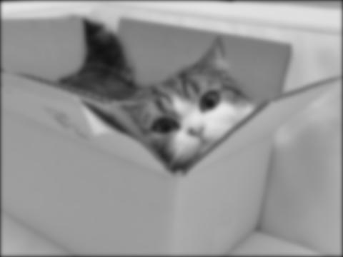

# CPSC 425: HW2
Tristan Rice, q7w9a, 25886145


## Question 1

```python
def boxfilter(n):
    assert n % 2 == 1, "Dimension must be odd"
    return np.full((n,n), 1/(n*n))
```

```
>>> boxfilter(3)
array([[ 0.11111111,  0.11111111,  0.11111111],
       [ 0.11111111,  0.11111111,  0.11111111],
       [ 0.11111111,  0.11111111,  0.11111111]])
>>> boxfilter(4)
Traceback (most recent call last):
  File "<stdin>", line 1, in <module>
  File "hw2.py", line 7, in boxfilter
    assert n % 2 == 1, "Dimension must be odd"
AssertionError: Dimension must be odd
>>> boxfilter(5)
array([[ 0.04,  0.04,  0.04,  0.04,  0.04],
       [ 0.04,  0.04,  0.04,  0.04,  0.04],
       [ 0.04,  0.04,  0.04,  0.04,  0.04],
       [ 0.04,  0.04,  0.04,  0.04,  0.04],
       [ 0.04,  0.04,  0.04,  0.04,  0.04]])
```

## Question 2

```python
def gauss1d(sigma):
    # l is the length of the gaussian filter
    l = math.ceil(sigma * 6)
    if l % 2 == 0:
        l += 1
    edge = math.floor(l/2)
    a = np.arange(-edge, edge+1, 1)
    f = np.exp(-np.power(a, 2)/(2*math.pow(sigma,2)))
    f /= np.sum(f)
    return f
```

```
>>> gauss1d(0.3)
array([ 0.00383626,  0.99232748,  0.00383626])
>>> gauss1d(0.5)
array([ 0.10650698,  0.78698604,  0.10650698])
>>> gauss1d(1)
array([ 0.00443305,  0.05400558,  0.24203623,  0.39905028,  0.24203623,
        0.05400558,  0.00443305])
>>> gauss1d(2)
array([ 0.0022182 ,  0.00877313,  0.02702316,  0.06482519,  0.12110939,
        0.17621312,  0.19967563,  0.17621312,  0.12110939,  0.06482519,
        0.02702316,  0.00877313,  0.0022182 ])
```

## Question 3

```python
def gauss2d(sigma):
    d1 = gauss1d(sigma)
    d2 = d1[np.newaxis]
    d2t = np.transpose(d2)
    return signal.convolve2d(d2,d2t)
```

```
>>> gauss2d(0.5)
array([[ 0.01134374,  0.08381951,  0.01134374],
       [ 0.08381951,  0.61934703,  0.08381951],
       [ 0.01134374,  0.08381951,  0.01134374]])
>>> gauss2d(1)
array([[  1.96519161e-05,   2.39409349e-04,   1.07295826e-03,
          1.76900911e-03,   1.07295826e-03,   2.39409349e-04,
          1.96519161e-05],
       [  2.39409349e-04,   2.91660295e-03,   1.30713076e-02,
          2.15509428e-02,   1.30713076e-02,   2.91660295e-03,
          2.39409349e-04],
       [  1.07295826e-03,   1.30713076e-02,   5.85815363e-02,
          9.65846250e-02,   5.85815363e-02,   1.30713076e-02,
          1.07295826e-03],
       [  1.76900911e-03,   2.15509428e-02,   9.65846250e-02,
          1.59241126e-01,   9.65846250e-02,   2.15509428e-02,
          1.76900911e-03],
       [  1.07295826e-03,   1.30713076e-02,   5.85815363e-02,
          9.65846250e-02,   5.85815363e-02,   1.30713076e-02,
          1.07295826e-03],
       [  2.39409349e-04,   2.91660295e-03,   1.30713076e-02,
          2.15509428e-02,   1.30713076e-02,   2.91660295e-03,
          2.39409349e-04],
       [  1.96519161e-05,   2.39409349e-04,   1.07295826e-03,
          1.76900911e-03,   1.07295826e-03,   2.39409349e-04,
          1.96519161e-05]])
```

## Question 4

```python
def gaussconvolve2d(array, sigma):
    filt = gauss2d(sigma)
    return signal.convolve2d(array, filt, 'same')

im = Image.open("maru.jpg").convert('L')
im.show()

im2 = Image.fromarray(np.uint8(gaussconvolve2d(np.asarray(im), 3)))
im2.show()
```

\


\


## Question 5

Since Gaussian blur is separable, that means you can define it as the product of
two functions one of x and one of y. Once done it's possible to take the Fourier
transforms of all the functions and simplify the calculation of the convolution
to just multiplication which can be done very efficiently on a GPU in parallel.
