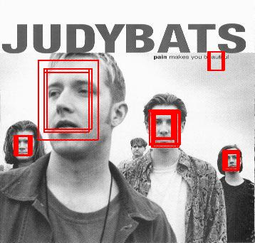
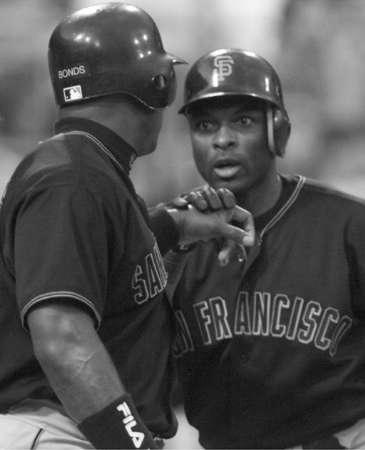
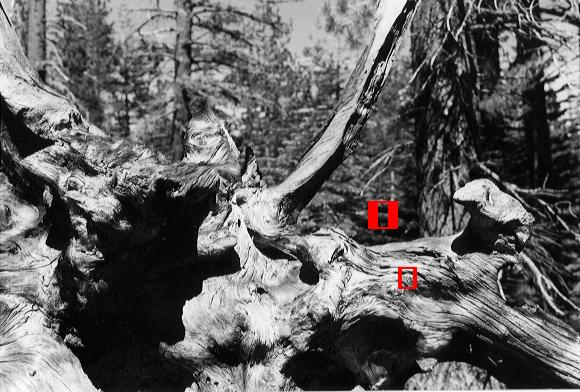

# CPSC 425: Assignment 3: Face Detection in a Scaled Representation
Tristan Rice, q7w9a, 25886145

## 3. ShowPyramid

\


## 5. Finding Even Matches

Threshold | False Negatives | False Positives| Best
----------|-----------------|----------------|-----
0.6 | 11 | 8  |
0.55 | 9 | 15 |
0.58 | 10 | 10 | picked

## 6. Recall

File | Recall
-----|-------
family.jpg | 2/3
fans.jpg | 0/3
judybats.jpg | 4/5
sports.jpg | 0/1
students.jpg | 23/27
tree.jpg | 0/0

The recall using NCC is sometimes very low on certain images due to differing
lighting conditions, face rotation, or other factors that cause the face to be
significantly different from the template.

## Code

```python
from PIL import Image, ImageDraw
import numpy as np
import math
from scipy import signal
import ncc


def MakePyramid(image, minsize):
    images = []
    scale = 1
    while(min(image.size)*scale > minsize):
        x, y = image.size
        img = image.resize((int(x*scale), int(y*scale)), Image.BICUBIC)
        img.scale = scale
        images.append(img)
        scale *= 0.75

    return images

def ShowPyramid(pyramid, save=False):
    height = max([img.size[1] for img in pyramid])
    width = sum([img.size[0] for img in pyramid])
    image = Image.new("L", (width, height), color=(255))
    offset_x = 0
    offset_y = 0
    for img in pyramid:
        image.paste(img, (offset_x, offset_y))
        offset_x += img.size[0]
    image.show()
    if save:
        image.save('output/pyramid.jpg')

def DrawBox(im, x, y, width, height):
    x -= width/2
    y -= height/2
    draw = ImageDraw.Draw(im)
    draw.line((x,y,x,y+height), fill="red", width=2)
    draw.line((x,y+height,x+width, y+height), fill="red", width=2)
    draw.line((x+width,y,x+width, y+height), fill="red", width=2)
    draw.line((x,y,x+width, y), fill="red", width=2)
    del draw

def FindTemplate(pyramid, template, threshold, show=True, save=False):
    template_width = 15
    x, y = template.size
    template = template.resize((int(template_width), int(y*template_width/x)), Image.BICUBIC)

    faces = []
    for img in pyramid:
        corr = ncc.normxcorr2D(img, template)
        rows = len(corr)
        columns = len(corr[0])
        for y in range(rows):
            for x in range(columns):
                if corr[y][x] < threshold:
                    continue
                scale = 1/img.scale
                w, h = template.size
                face = (x*scale, y*scale, w*scale, h*scale)
                faces.append(face)

    if show or save:
        output = pyramid[0].convert('RGB')
        for face in faces:
            DrawBox(output, *face);
        if show:
            output.show()
        if save:
            output.save(save)

    return faces

def RegionOverlap(a, b):
    ax, ay, aw, ah = a
    bx, by, bw, bh = b
    return ax < (bx + bw) and (ax + aw) > bx and ay < (by + bh) and (ay + ah) > by

def RegionOverlapsArea(regions, region):
    for r in regions:
        if RegionOverlap(r, region):
            return True
    return False

def UniqRegions(regions):
    count = 0
    visited = []
    for region in regions:
        if len(visited) == 0 or not RegionOverlapsArea(visited, region):
            count += 1
        visited.append(region)
    return count

pics = [
    ('judybats.jpg', 5),
    ('family.jpg', 3),
    ('fans.jpg', 3),
    ('sports.jpg', 1),
    ('students.jpg',27),
    ('tree.jpg', 0),
]

pics = [(path, faces, Image.open('faces/'+path)) for path, faces in pics]

template = Image.open("faces/template.jpg")
threshold = 0.58
for path, faces, im in pics:
    pyramid = MakePyramid(im, 10)
    #ShowPyramid(pyramid,save=True)
    found = FindTemplate(pyramid, template, threshold) #, show=False, save='output/'+path)
    count = UniqRegions(found)
    print(path, faces, count, len(found))
```

## Photos


\


\


\


\


\


\
