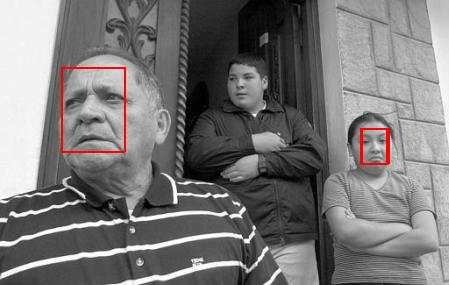
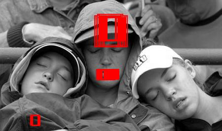
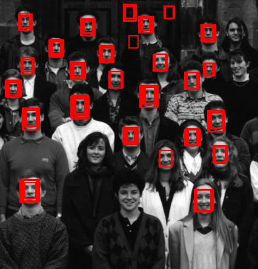

# CPSC 425: Assignment 3: Face Detection in a Scaled Representation
Tristan Rice, q7w9a, 25886145

2016-02-02

I found out that my original submission of hw3 didn't have enough comments after
turning it in and getting my hw2 back. So I'm using 1 late day to resubmit this
assignment.

Please ignore the original submission.

## 3. ShowPyramid

\


## 5. Finding Even Matches

Threshold | False Negatives | False Positives| Best
----------|-----------------|----------------|-----
0.6 | 11 | 8  |
0.55 | 9 | 15 |
0.58 | 10 | 10 | picked

## 6. Recall

File | Recall
-----|-------
family.jpg | 2/3
fans.jpg | 0/3
judybats.jpg | 4/5
sports.jpg | 0/1
students.jpg | 23/27
tree.jpg | 0/0

The recall using NCC is sometimes very low on certain images due to differing
lighting conditions, face rotation, or other factors that cause the face to be
significantly different from the template.

## Code

```python
# Import all required libraries.
from PIL import Image, ImageDraw
import numpy as np
import math
from scipy import signal
import ncc

# MakePyramid returns an array of images where each one is 0.75 the one before
# with the smallest image being just larger than minsize.
def MakePyramid(image, minsize):
    # Array to store images in
    images = []
    # Scale for each iteration of the loop starts at 1 since we want the
    # original image in the loop.
    scale = 1
    # Original image x and y sizes.
    x, y = image.size
    # Continue adding images until we hit minsize.
    while(min(image.size)*scale > minsize):
        # Make a new image based of the original with the specified scale.
        img = image.resize((int(x*scale), int(y*scale)), Image.BICUBIC)
        # Save the scale into the image so I can scale it back up accurately
        # later.
        img.scale = scale
        # Add the image to the images array
        images.append(img)
        # Update the scale for the next image so it'll be 0.75 the size.
        scale *= 0.75

    # Return the final pyramid of images.
    return images

# ShowPyramid combines all of the images in the pyramid into one image arranged
# horizontally and then displays it.
def ShowPyramid(pyramid, save=False):
    # Find the max height in the pyramid.
    height = max([img.size[1] for img in pyramid])
    # Sum all of the widths to know how large the final image needs to be.
    width = sum([img.size[0] for img in pyramid])
    # Create a new image with the necessary height and width.
    image = Image.new("L", (width, height), color=(255))
    # First image should have an offset of 0.
    offset_x = 0
    # Iterate through each image and draw it.
    for img in pyramid:
        # Add each image to the main image with the needed offset.
        image.paste(img, (offset_x, 0))
        # Update the offset so the next image is drawn to the right of the
        # previous image.
        offset_x += img.size[0]
    # Show the final rendered pyramid
    image.show()
    # If save is specified, save it to a file so it can be used later.
    if save:
        image.save('output/pyramid.jpg')

# DrawBox draws a red box on the image centered at x, y with a specified width
# and height.
def DrawBox(im, x, y, width, height):
    # Compute the upper left corner.
    x -= width/2
    y -= height/2
    # Create a new ImageDraw object.
    draw = ImageDraw.Draw(im)
    # Draw four lines in the shape of a box with red lines.
    draw.line((x,y,x,y+height), fill="red", width=2)
    draw.line((x,y+height,x+width, y+height), fill="red", width=2)
    draw.line((x+width,y,x+width, y+height), fill="red", width=2)
    draw.line((x,y,x+width, y), fill="red", width=2)
    # Remove the ImageDraw object.
    del draw

# FindTemplate finds all occurrences of template in the pyramid (a list of
# images) using NCC and returns an array of tuples of the X, Y, Height, Width of
# the image.
# If show is True, render the faces onto the first image and display it.
# If save is a String, save the output from show to the specified path.
def FindTemplate(pyramid, template, threshold, show=True, save=False):
    # Constant representing the target template width.
    template_width = 15
    # Get the template image size.
    x, y = template.size
    # Resize the template to be the targeted template width.
    template = template.resize((int(template_width), int(y*template_width/x)), Image.BICUBIC)

    # An array to store the faces into.
    faces = []
    # For each of the images in the pyramid check for faces.
    for img in pyramid:
        # Calculate the NCC correlation at each pixel in the image.
        corr = ncc.normxcorr2D(img, template)
        # Compute the height and width of the outputted correlations.
        rows = len(corr)
        columns = len(corr[0])
        # For each value in the correlation matrix check if it's over the
        # threshold and if so save.
        for y in range(rows):
            for x in range(columns):
                # If the correlation is less than the threshold, ignore the
                # point.
                if corr[y][x] < threshold:
                    continue
                # Compute the original X, Y, width, height values before img was
                # scaled into the pyramid.
                scale = 1/img.scale
                w, h = template.size
                face = (x*scale, y*scale, w*scale, h*scale)
                # Save the face
                faces.append(face)

    # Output the rendered image if show or save.
    if show or save:
        # Convert the first image (the original) to RGB so we can draw red boxes
        # on it.
        output = pyramid[0].convert('RGB')
        # For each face draw a box around it.
        for face in faces:
            # *face expands the tuple into (x, y, width, height) arguments.
            DrawBox(output, *face);
        # Show the image if specified.
        if show:
            output.show()
        # Save the image to the path if specified.
        if save:
            output.save(save)

    return faces

# An array of all images that should be searched for faces.
pics = [
    'judybats.jpg',
    'family.jpg',
    'fans.jpg',
    'sports.jpg',
    'students.jpg',
    'tree.jpg',
]

# Load each image and create an array of (path, image) data for each picture.
pics = [(path, Image.open('faces/'+path)) for path in pics]

# Load the template image
template = Image.open("faces/template.jpg")
# The correlation threshold for whether the spot is a face or not.
threshold = 0.58

# For each image find the template in it.
for path, im in pics:
    # Need to make a pyramid of images so we can match the template at multiple
    # zoom levels.
    pyramid = MakePyramid(im, 10)
    # Find all template matches in the pyramid with threshold.
    found = FindTemplate(pyramid, template, threshold, show=False)
    # Output the found faces to terminal.
    print(path, found)
```

## Photos


\


\


\


\


\


\
