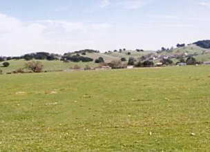
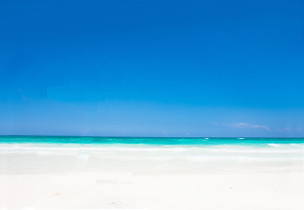
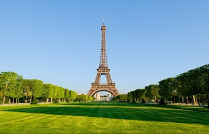
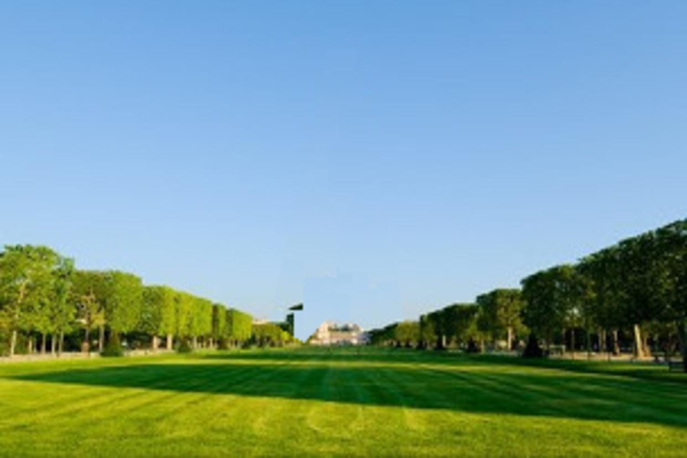

# CPSC 425: Computer Vision - Assignment 4: Texture Synthesis

Tristan Rice, 25886145, q7w9a

## Question 5

\


## Question 6

### Umbrella

\


\


### Eiffel Tower

\


\


This image performed poorly near the left base of the tower. This is because the
sample region didn't have any good matches for what happens at the base.


## Question 7

`randomPatchSD` is used to pick the patch to use. Since we don't want the texture
to be too uniform when filling, this code uses `random.gauss(0, randomPatchSD)`
to pick a number from a gaussian distribution with mean `0`, standard deviation
`randomPatchSD`. This allows there to be some variation in the patches picked,
while still favoring those with the lowest SSD. If `randomPatchSD` is too large,
there will be a high variation in texture, and many patches chosen may be poor
fits. If `randomPatchSD` is too small, there will be a very uniform (and
possibly unnatural) fill.

`patchL` specifies how large the patches will be. The larger the `patchL` there
is, the more it is able to match the surrounding context and repeat patterns.
However, if `patchL` is too large, the patches will become noticeable since it
will be copying full features of the image and not just the textures. If
`patchL` is too small, it won't be able to accurately replicate the textures
since it's looking for the best match at a too small of scale.

## Final Code

Holefill.py

```python
from PIL import Image, ImageDraw
import numpy as np
import random
import os.path
import pickle

##############################################################################
#                        Functions for you to complete                       #
##############################################################################

def ComputeSSD(TODOPatch, TODOMask, textureIm, patchL):
	# Create a 3D mask that can be applied to the patch. Need to go from 2d
	# to 3d since there are 3 channels per pixel.
	mask3d = np.zeros_like(TODOPatch)
	# For each channel set it to the mask.
	for i in range(3):
		mask3d[:,:,i] = TODOMask
	# Create the masked patch. This will allow us to use numpy vectorized
	# operations on only the data not masked.
	maskedPatch = np.ma.array(TODOPatch, mask=mask3d)
	# Coerce into a float.
	maskedPatch = maskedPatch*1.0

        # Compute number of rows, columns, as well as the final size of the SSD
	# output.
	patch_rows, patch_cols, patch_bands = np.shape(TODOPatch)
	tex_rows, tex_cols, tex_bands = np.shape(textureIm)
	ssd_rows = tex_rows - 2 * patchL
	ssd_cols = tex_cols - 2 * patchL
	SSD = np.zeros((ssd_rows,ssd_cols))
	# Compute SSD for each pixel.
	for r in range(ssd_rows):
		for c in range(ssd_cols):
			# Compute sum square difference between textureIm and TODOPatch
			# for all pixels where TODOMask = 0, and store the result in SSD
			#
			# ADD YOUR CODE HERE

			# Grab sub part of the image.
			subTexture = textureIm[r:(r+patch_rows), c:(c+patch_cols)]
			# Compute SSD for the target part of image and the
			# masked patch.
			SSD[r, c] = np.sum((maskedPatch - subTexture)**2)
	return SSD

def CopyPatch(imHole,TODOMask,textureIm,iPatchCenter,jPatchCenter,iMatchCenter,jMatchCenter,patchL):
	# Find the patch that will be copied into imHole.
	selectPatch = textureIm[iMatchCenter-patchL:iMatchCenter+patchL+1,jMatchCenter-patchL:jMatchCenter+patchL+1,:]
	patchSize = 2 * patchL + 1

	# For each pixel in selectPatch, copy it into the final output image.
	for i in range(patchSize):
		for j in range(patchSize):
			# Copy the selected patch selectPatch into the image containing
			# the hole imHole for each pixel where TODOMask = 1.
			# The patch is centred on iPatchCenter, jPatchCenter in the image imHole
			#
			# ADD YOUR CODE HERE

                        # Don't copy the pixel if it's outsize the masked
			# region.
			if TODOMask[i, j] == 0:
				continue

			# Compute the final x, y coordinates of the pizel in
			# imHole.
			dx = i - patchL
			dy = j - patchL
			# Copy the pixel to imHole.
			imHole[iPatchCenter+dx, jPatchCenter+dy] = selectPatch[i, j]
	return imHole

##############################################################################
#                            Some helper functions                           #
##############################################################################

def DrawBox(im,x1,y1,x2,y2):
	draw = ImageDraw.Draw(im)
	draw.line((x1,y1,x1,y2),fill="white",width=1)
	draw.line((x1,y1,x2,y1),fill="white",width=1)
	draw.line((x2,y2,x1,y2),fill="white",width=1)
	draw.line((x2,y2,x2,y1),fill="white",width=1)
	del draw
	return im

def Find_Edge(hole_mask):
	[cols, rows] = np.shape(hole_mask)
	edge_mask = np.zeros(np.shape(hole_mask))
	for y in range(rows):
		for x in range(cols):
			if (hole_mask[x,y] == 1):
				if (hole_mask[x-1,y] == 0 or
						hole_mask[x+1,y] == 0 or
						hole_mask[x,y-1] == 0 or
						hole_mask[x,y+1] == 0):
					edge_mask[x,y] = 1
	return edge_mask

##############################################################################
#                           Main script starts here                          #
##############################################################################

#
# Constants
#

# Change patchL to change the patch size used (patch size is 2 *patchL + 1)
patchL = 10
patchSize = 2*patchL+1

# Standard deviation for random patch selection
randomPatchSD = 1

# Display results interactively
showResults = True

#
# Read input image
#

im = Image.open('umbrella.jpg').convert('RGB')
im_array = np.asarray(im, dtype=np.uint8)
imRows, imCols, imBands = np.shape(im_array)

#
# Define hole and texture regions.  This will use files fill_region.pkl and
#   texture_region.pkl, if both exist, otherwise user has to select the regions.
if os.path.isfile('fill_region.pkl') and os.path.isfile('texture_region.pkl'):
	fill_region_file = open('fill_region.pkl', 'rb')
	fillRegion = pickle.load( fill_region_file )
	fill_region_file.close()

	texture_region_file = open('texture_region.pkl', 'rb')
	textureRegion = pickle.load( texture_region_file )
	texture_region_file.close()
else:
	# ask the user to define the regions
	print("Specify the fill and texture regions using polyselect.py")
	exit()

#
# Get coordinates for hole and texture regions
#

fill_indices = fillRegion.nonzero()
nFill = len(fill_indices[0])                # number of pixels to be filled
iFillMax = max(fill_indices[0])
iFillMin = min(fill_indices[0])
jFillMax = max(fill_indices[1])
jFillMin = min(fill_indices[1])
assert((iFillMin >= patchL) and
		(iFillMax < imRows - patchL) and
		(jFillMin >= patchL) and
		(jFillMax < imCols - patchL)) , "Hole is too close to edge of image for this patch size"

texture_indices = textureRegion.nonzero()
iTextureMax = max(texture_indices[0])
iTextureMin = min(texture_indices[0])
jTextureMax = max(texture_indices[1])
jTextureMin = min(texture_indices[1])
textureIm   = im_array[iTextureMin:iTextureMax+1, jTextureMin:jTextureMax+1, :]
texImRows, texImCols, texImBands = np.shape(textureIm)
assert((texImRows > patchSize) and
		(texImCols > patchSize)) , "Texture image is smaller than patch size"

#
# Initialize imHole for texture synthesis (i.e., set fill pixels to 0)
#

imHole = im_array.copy()
imHole[fill_indices] = 0

#
# Is the user happy with fillRegion and textureIm?
#
if showResults == True:
	# original
	im.show()
	# convert to a PIL image, show fillRegion and draw a box around textureIm
	im1 = Image.fromarray(imHole).convert('RGB')
	im1 = DrawBox(im1,jTextureMin,iTextureMin,jTextureMax,iTextureMax)
	im1.show()
	"""
	print("Are you happy with this choice of fillRegion and textureIm?")
	Yes_or_No = False
	while not Yes_or_No:
		answer = input("Yes or No: ")
		if answer == "Yes" or answer == "No":
			Yes_or_No = True
	assert answer == "Yes", "You must be happy. Please try again."
	"""

#
# Perform the hole filling
#

while (nFill > 0):
	print("Number of pixels remaining = " , nFill)

	# Set TODORegion to pixels on the boundary of the current fillRegion
	TODORegion = Find_Edge(fillRegion)
	edge_pixels = TODORegion.nonzero()
	nTODO = len(edge_pixels[0])

	while(nTODO > 0):

		# Pick a random pixel from the TODORegion
		index = np.random.randint(0,nTODO)
		iPatchCenter = edge_pixels[0][index]
		jPatchCenter = edge_pixels[1][index]

		# Define the coordinates for the TODOPatch
		TODOPatch = imHole[iPatchCenter-patchL:iPatchCenter+patchL+1,jPatchCenter-patchL:jPatchCenter+patchL+1,:]
		TODOMask = fillRegion[iPatchCenter-patchL:iPatchCenter+patchL+1,jPatchCenter-patchL:jPatchCenter+patchL+1]

		#
		# Compute masked SSD of TODOPatch and textureIm
		#
		ssdIm = ComputeSSD(TODOPatch, TODOMask, textureIm, patchL)

		# Randomized selection of one of the best texture patches
		ssdIm1 = np.sort(np.copy(ssdIm),axis=None)
		ssdValue = ssdIm1[min(round(abs(random.gauss(0,randomPatchSD))),np.size(ssdIm1)-1)]
		ssdIndex = np.nonzero(ssdIm==ssdValue)
		iSelectCenter = ssdIndex[0][0]
		jSelectCenter = ssdIndex[1][0]

		# adjust i, j coordinates relative to textureIm
		iSelectCenter = iSelectCenter + patchL
		jSelectCenter = jSelectCenter + patchL
		selectPatch = textureIm[iSelectCenter-patchL:iSelectCenter+patchL+1,jSelectCenter-patchL:jSelectCenter+patchL+1,:]

		#
		# Copy patch into hole
		#
		imHole = CopyPatch(imHole,TODOMask,textureIm,iPatchCenter,jPatchCenter,iSelectCenter,jSelectCenter,patchL)

		# Update TODORegion and fillRegion by removing locations that overlapped the patch
		TODORegion[iPatchCenter-patchL:iPatchCenter+patchL+1,jPatchCenter-patchL:jPatchCenter+patchL+1] = 0
		fillRegion[iPatchCenter-patchL:iPatchCenter+patchL+1,jPatchCenter-patchL:jPatchCenter+patchL+1] = 0

		edge_pixels = TODORegion.nonzero()
		nTODO = len(edge_pixels[0])

	fill_indices = fillRegion.nonzero()
	nFill = len(fill_indices[0])

#
# Output results
#
if showResults == True:
	Image.fromarray(imHole).convert('RGB').show()
Image.fromarray(imHole).convert('RGB').save('results.jpg')
```
