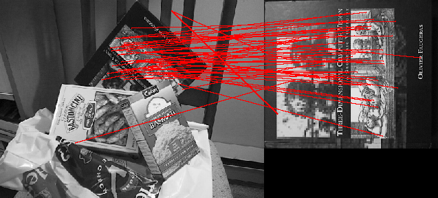
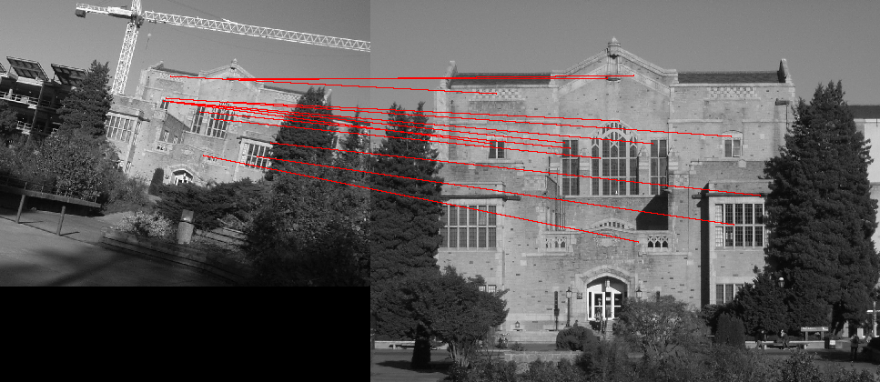

# CPSC 425, HW5
Tristan Rice, q7w9a, 25886145

## Question 3

For "scene", "book", a threshold value of about 0.7 gives fairly good results.
Most of the points are correct, with only a handful mismatches. The value needs
to be somewhat accurate. Without a threshold value there are more mismatches
than correct matches, and too low you only get a few good matches.

\


## Question 4

For the UBC library, an angle threshold of 14degress and a size threshold of
10% is fairly effective.

\


## Code

```python
from PIL import Image, ImageDraw
import numpy as np
import csv
import math
import random

random.seed()

def ReadKeys(image):
    """Input an image and its associated SIFT keypoints.

    The argument image is the image file name (without an extension).
    The image is read from the PGM format file image.pgm and the
    keypoints are read from the file image.key.

    ReadKeys returns the following 3 arguments:

    image: the image (in PIL 'RGB' format)

    keypoints: K-by-4 array, in which each row has the 4 values specifying
    a keypoint (row, column, scale, orientation).  The orientation
    is in the range [-PI, PI] radians.

    descriptors: a K-by-128 array, where each row gives a descriptor
    for one of the K keypoints.  The descriptor is a 1D array of 128
    values with unit length.
    """
    im = Image.open(image+'.pgm').convert('RGB')
    keypoints = []
    descriptors = []
    first = True
    with open(image+'.key','r') as f:
        reader = csv.reader(f, delimiter=' ', quoting=csv.QUOTE_NONNUMERIC,skipinitialspace = True)
        descriptor = []
        for row in reader:
            if len(row) == 2:
                assert first, "Invalid keypoint file header."
                assert row[1] == 128, "Invalid keypoint descriptor length in header (should be 128)."
                count = row[0]
                first = False
            if len(row) == 4:
                keypoints.append(np.array(row))
            if len(row) == 20:
                descriptor += row
            if len(row) == 8:
                descriptor += row
                assert len(descriptor) == 128, "Keypoint descriptor length invalid (should be 128)."
                #normalize the key to unit length
                descriptor = np.array(descriptor)
                descriptor = descriptor / math.sqrt(np.sum(np.power(descriptor,2)))
                descriptors.append(descriptor)
                descriptor = []
    assert len(keypoints) == count, "Incorrect total number of keypoints read."
    print("Number of keypoints read:", int(count))
    return [im,keypoints,descriptors]

def AppendImages(im1, im2):
    """Create a new image that appends two images side-by-side.

    The arguments, im1 and im2, are PIL images of type RGB
    """
    im1cols, im1rows = im1.size
    im2cols, im2rows = im2.size
    im3 = Image.new('RGB', (im1cols+im2cols, max(im1rows,im2rows)))
    im3.paste(im1,(0,0))
    im3.paste(im2,(im1cols,0))
    return im3

def DisplayMatches(im1, im2, matched_pairs):
    """Display matches on a new image with the two input images placed side by side.

    Arguments:
     im1           1st image (in PIL 'RGB' format)
     im2           2nd image (in PIL 'RGB' format)
     matched_pairs list of matching keypoints, im1 to im2

    Displays and returns a newly created image (in PIL 'RGB' format)
    """
    im3 = AppendImages(im1,im2)
    offset = im1.size[0]
    draw = ImageDraw.Draw(im3)
    for match in matched_pairs:
        draw.line((match[0][1], match[0][0], offset+match[1][1], match[1][0]),fill="red",width=2)
    im3.show()
    return im3

def match(image1,image2):
    """Input two images and their associated SIFT keypoints.
    Display lines connecting the best matching pairs.

    The arguments image1 and image2 are file names without file extensions.

    Returns the rendered image.

    Example: match('scene','book')
    """
    im1, keypoints1, descriptors1 = ReadKeys(image1)
    im2, keypoints2, descriptors2 = ReadKeys(image2)

    # List to store the matched pairs.
    matched_pairs = []

    # For each point in the second image compute the best matching point.
    for k2, d2 in zip(keypoints2, descriptors2):
        angles = []
        for k1, d1 in zip(keypoints1, descriptors1):
            # Compute the angle between the two points descriptors and add it to
            # the angles list.
            angles.append(math.acos(np.sum(np.array(d1)*np.array(d2))))

        # Calculate the two smallest angles.
        smallest, second = sorted(angles)[0:2]
        # Check if the ratio is below the threshold.
        if smallest/second < 0.7:
            # Since it's below the threshold, find the keypoint and add it to
            # the list of matched pairs.
            k1 = keypoints1[angles.index(smallest)]
            matched_pairs.append([k1, k2])

    # Apply RANSAC to minimize bad matches.

    # Shorthand variable.
    tau = math.pi*2 #

    # Thresholds for angle and size.
    angleThreshold = math.pi/40 # 14deg
    sizeThreshold = 0.10 # 10%

    # Array to store the largest consistent set.
    bestFound = []

    # Sample 10 points without replacement to check for points that are
    # consistent with.
    for [k1, k2] in random.sample(matched_pairs, 10):
        # Compute the difference in size and angle between the first matched
        # pair.
        angle = (k1[3] - k2[3]) % tau
        size = (k1[2] / k2[2])

        consistent = []
        for [k3, k4] in matched_pairs:
            # Compute the difference in size and angle between the second
            # matched pair.
            angle2 = (k3[3] - k4[3]) % tau
            size2 = (k3[2] / k4[2])

            # Compute the difference in angle differences of the two pairs.
            angleDiff = (angle-angle2) % tau

            # If angle is larger than PI subtract PI since the maximum distance
            # two angles can be apart is PI.
            if angleDiff > math.pi:
                angleDiff -= math.pi

            # Compute the difference in size differences of the two pairs.
            sizeDiff = abs(size - size2)

            print(angleDiff, sizeDiff)

            # If the two pairs are consistent according to the thresholds add
            # them to the consistent list.
            if angleDiff <= angleThreshold and sizeDiff <= sizeThreshold:
                consistent.append([k3, k4])

        # If this consistent set is larger than any of the previous, make it the
        # new best found set.
        if len(consistent) > len(bestFound):
            bestFound = consistent


    im3 = DisplayMatches(im1, im2, bestFound)
    return im3

#Test run...
match('library2','library')
```
