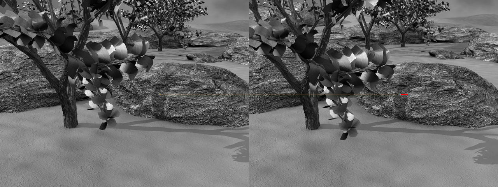

# CPSC 425 - HW6

Tristan Rice, q7w9a, 25886145

## Question 5

\

The point is successfully tracked in all frames with a window size of 21, sigma
of 1.5 and box filter size of 3.

Positions:
```
start: (411, 242)
frame08.png: (408.00278821, 242.26487403)
frame09.png: (405.0240139, 242.46885774)
frame10.png: (402.11704449, 242.78434341)
frame11.png: (399.20112362, 243.02332865)
frame12.png: (396.1820769, 243.23971609)
frame13.png: (393.30497279, 243.49761305)
```

## Question 6

The Lucas–Kanade method is bad at tracking locations where the derivative is
close to zero such as in the center of a large uniformly color object such as
the sky.

It will also perform poorly when there is random noise in the image. For
instance, if the photos were taken in low light conditions there will be lots of
random noise that it may incorrectly track.

## Code

```python
from PIL import Image, ImageDraw
import matplotlib.pyplot as plt
import numpy as np
import math
from scipy import signal
import numpy.linalg as lin

# START OF FUNCTIONS CARRIED FORWARD FROM ASSIGNMENT 2

def boxfilter(n):
    """
    Compute a box filter with specified size. n must be odd.
    """

    assert n % 2 == 1, "Dimension must be odd"
    return np.full((n,n), 1/(n*n))

def gauss1d(sigma):
    """
    Compute a 1d gausian filter with specified sigma.
    """

    # l is the length of the gaussian filter
    l = math.ceil(sigma * 6)
    if l % 2 == 0:
        l += 1
    # Radius of the filter.
    edge = math.floor(l/2)
    # Compute the gaussian along -edge to edge.
    a = np.arange(-edge, edge+1, 1)
    f = np.exp(-np.power(a, 2)/(2*math.pow(sigma,2)))

    # Normalize
    f /= np.sum(f)
    return f

def gauss2d(sigma):
    """
    Compute a 2d gaussian filter with specified sigma.
    """

    d1 = gauss1d(sigma)
    d2 = d1[np.newaxis]
    d2t = np.transpose(d2)

    # 2d gaussian filter is equivalent to convolving a 1d filter with itself.
    return signal.convolve2d(d2,d2t)

def gaussconvolve2d(array, sigma):
    """
    Convolve an array with a 2d gaussian filter with specified sigma.
    """

    # Compute the filter.
    filt = gauss2d(sigma)
    # Convolve the array with the filter.
    return signal.convolve2d(array, filt, 'same')

# END OF FUNCTIONS CARRIED FORWARD FROM ASSIGNMENT 2

# Define a function, boxconvolve2d, to convolve an image with a boxfilter of size n
# (used in Estimate_Derivatives below).

def boxconvolve2d(image, n):
    """
    Convolve the image with a box filter of size n.
    """

    # Generate box filter and convolve image with it.
    return signal.convolve2d(image, boxfilter(n), 'same')

def Estimate_Derivatives(im1, im2, sigma=1.5, n=3):
    """
    Estimate spatial derivatives of im1 and temporal derivative from im1 to im2.

    Smooth im1 with a 2D Gaussian of the given sigma.  Use first central difference to
    estimate derivatives.

    Use point-wise difference between (boxfiltered) im2 and im1 to estimate temporal derivative
    """
    # UNCOMMENT THE NEXT FOUR LINES WHEN YOU HAVE DEFINED THE FUNCTIONS ABOVE

    # Compute directional gradients.
    im1_smoothed = gaussconvolve2d(im1,sigma)
    Ix, Iy = np.gradient(im1_smoothed)
    It = boxconvolve2d(im2, n) - boxconvolve2d(im1, n)

    # Ensure sizes are correct.
    assert It.size == im2.size
    assert It.size == im1.size

    return Ix, Iy, It

def np_to_int(v):
    """
    Enforce the value is an integer for use in python indices and ranges.
    Will convert np.ndarray to int.
    """

    # Take first element if it's a numpy.ndarray (size 1).
    if isinstance(v, np.ndarray):
        return np_to_int(v[0])

    # Convert float to int.
    if isinstance(v, np.float64):
        return int(v)

    return v

def Optical_Flow(im1, im2, x, y, window_size, sigma=1.5, n=3):
    assert((window_size % 2) == 1) , "Window size must be odd"
    # Enforce x and y are standard python ints to avoid issues when using them
    # as indices.
    x = np_to_int(x)
    y = np_to_int(y)
    # UNCOMMENT THE NEXT LINE WHEN YOU HAVE COMPLETED Estimate_Derivatives
    Ix, Iy, It = Estimate_Derivatives(im1, im2, sigma, n)
    half = math.floor(window_size/2)
    # select the three local windows of interest
    # UNCOMMENT THE NEXT LINE WHEN YOU HAVE COMPLETED Estimate_Derivatives
    win_Ix = Ix[y-half-1:y+half, x-half-1:x+half].T
    #
    # PROVIDE THE REST OF THE IMPLEMENTATION HERE (BASED ON THE WIKIPEDIA ARTICLE)
    #
    win_Iy = Iy[y-half-1:y+half, x-half-1:x+half].T
    win_It = It[y-half-1:y+half, x-half-1:x+half].T

    # Reshape the pixels into 1d matrices so we can pack them into A.
    flatIx = np.reshape(win_Ix, (window_size*window_size, 1))
    flatIy = np.reshape(win_Iy, (window_size*window_size, 1))

    # Use Ix as column 1, and Iy as column 2.
    A = np.column_stack((flatIx, flatIy))

    # Reshape b into a 1d matrix to match Ix, Iy
    b = -np.reshape(win_It, (window_size*window_size, 1))

    # Compute least squares using the pixel data.
    V = np.matmul(np.linalg.inv(np.matmul(A.T, A)), np.matmul(A.T, b))
    #################################
    # change the return line to:
    return V[1], V[0]
    # (when you have completed the implementation)
    #################################
    #return -1, 2  # skeleton program returns a hard-coded value

def AppendImages(im1, im2):
    """Create a new image that appends two images side-by-side.

    The arguments, im1 and im2, are PIL images of type RGB
    """
    im1cols, im1rows = im1.size
    im2cols, im2rows = im2.size
    im3 = Image.new('RGB', (im1cols+im2cols, max(im1rows,im2rows)))
    im3.paste(im1,(0,0))
    im3.paste(im2,(im1cols,0))
    return im3

def DisplayFlow(im1, im2, x, y, uarr, varr):
    """Display optical flow match on a new image with the two input frames placed side by side.

    Arguments:
     im1           1st image (in PIL 'RGB' format)
     im2           2nd image (in PIL 'RGB' format)
     x, y          point coordinates in 1st image
     u, v          list of optical flow values to 2nd image

    Displays and returns a newly created image (in PIL 'RGB' format)
    """
    im3 = AppendImages(im1,im2)
    offset = im1.size[0]
    draw = ImageDraw.Draw(im3)
    xinit = x+uarr[0]
    yinit = y+varr[0]
    for u,v,ind in zip(uarr[1:], varr[1:], range(1, len(uarr))):
        draw.line((offset+xinit, yinit, offset+xinit+u, yinit+v),fill="red",width=2)
        xinit += u
        yinit += v
    draw.line((x, y, offset+xinit, yinit), fill="yellow", width=2)
    im3.show()
    del draw
    return im3

def HitContinue(Prompt='Hit any key to continue'):
    input(Prompt)

##############################################################################
#                  Here's your assigned target point to track                #
##############################################################################

# uncomment the next two lines if the leftmost digit of your student number is 0
#x=222
#y=213
# uncomment the next two lines if the leftmost digit of your student number is 1
#x=479
#y=141
# uncomment the next two lines if the leftmost digit of your student number is 2
x=411
y=242
# uncomment the next two lines if the leftmost digit of your student number is 3
#x=152
#y=206
# uncomment the next two lines if the leftmost digit of your student number is 4
#x=278
#y=277
# uncomment the next two lines if the leftmost digit of your student number is 5
#x=451
#y=66
# uncomment the next two lines if the leftmost digit of your student number is 6
#x=382
#y=65
# uncomment the next two lines if the leftmost digit of your student number is 7
#x=196
#y=197
# uncomment the next two lines if the leftmost digit of your student number is 8
#x=274
#y=126
# uncomment the next two lines if the leftmost digit of your student number is 9
#x=305
#y=164

##############################################################################
#                            Global "magic numbers"                          #
##############################################################################

# window size (for estimation of optical flow)
window_size=21

# sigma of the 2D Gaussian (used in the estimation of Ix and Iy)
sigma=1.5

# size of the boxfilter (used in the estimation of It)
n = 3

##############################################################################
#             basic testing (optical flow from frame 7 to 8 only)            #
##############################################################################

# scale factor for display of optical flow (to make result more visible)
scale=10

PIL_im1 = Image.open('frame07.png')
PIL_im2 = Image.open('frame08.png')
im1 = np.asarray(PIL_im1)
im2 = np.asarray(PIL_im2)
dx, dy = Optical_Flow(im1, im2, x, y, window_size, sigma, n)
print('Optical flow: [', dx, ',', dy, ']')
plt.imshow(im1, cmap='gray')
plt.hold(True)
plt.plot(x,y,'xr')
plt.plot(x+dx*scale,y+dy*scale, 'dy')
print('Close figure window to continue...')
plt.show()
uarr = [dx]
varr = [dy]

##############################################################################
#                   run the remainder of the image sequence                  #
##############################################################################

# UNCOMMENT THE CODE THAT FOLLOWS (ONCE BASIC TESTING IS COMPLETE/DEBUGGED)

print('frame 7 to 8')
DisplayFlow(PIL_im1, PIL_im2, x, y, uarr, varr)
HitContinue()

prev_im = im2
xcurr = x+dx
ycurr = y+dy
offset = PIL_im1.size[0]

# Print tracked positions.
print("start:", (x, y))
print("frame08.png:", (xcurr, ycurr))

for i in range(8, 14):
    im_i = 'frame%0.2d.png'%(i+1)
    print('frame', i, 'to', (i+1))
    PIL_im_i = Image.open('%s'%im_i)
    numpy_im_i = np.asarray(PIL_im_i)
    dx, dy = Optical_Flow(prev_im, numpy_im_i, xcurr, ycurr, window_size, sigma, n)
    print('flow', dx, dy)
    xcurr += dx
    ycurr += dy
    prev_im = numpy_im_i
    uarr.append(dx)
    varr.append(dy)
    # redraw the (growing) figure
    DisplayFlow(PIL_im1, PIL_im_i, x, y, uarr, varr)

    # Print tracked positions.
    print(im_i+":", (xcurr, ycurr))

    HitContinue()

##############################################################################
# Don't forget to include code to document the sequence of (x, y) positions  #
# of your feature in each frame successfully tracked.                        #
##############################################################################
```
