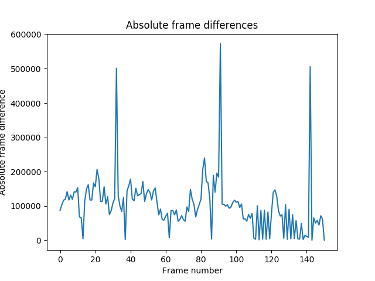

# CPSC 425 - HW7
Tristan Rice, 25886145, q7w9a

## 2.

\


## 4.

\


## 5.

\


## 6.

\


## 7.

\


## 8.

\


## 9. Which frame difference method is better? Why?

Absolute frame differences, squared frame differences, average gray frame
differences, and histogram frame differences all appear to be fairly good. The
only issue is that for gray frame differences you'd have to take the absolute
value since the value can be negative.

Squared frame difference seems to be a bit better than absolute frame difference
as the peaks between shots are slightly higher than those in between.

## 10. We worked with shots without camera movement. Which of our six methods do you think would work best if the camera were slowly moving instead of static? Why?

I think that color histograms and clustering would work best for a slowly moving
camera. Since it's taking the histogram it would be more resilient to per pixel
changes unlike the direct pixel by pixel differences. Clustering I believe would
also be more effective than just comparing the histograms between two pixels
since it's a more holistic approach, and would be able to take into account
things like panning something out of a shot and then back in.

## Code

Shot.py

```python
from PIL import Image, ImageDraw
import numpy as np
from scipy.cluster.vq import vq, kmeans
from scipy.spatial.distance import cdist
import matplotlib.pyplot as plt

# Computes the cost of given boundaries. Good boundaries have zero cost.
def get_boundaries_cost( boundaries, good_boundaries ):
    return np.sum( boundaries != good_boundaries );

# Finds the indices of color_histograms given a series of cluster centres.
def cluster2boundaries(histograms, centres):

    # Find the cluster assignment of each histogram
    distances = cdist( histograms, centres )
    idx       = np.argmin( distances, 1 )

    # Find the points where the index changes
    boundaries = np.zeros( len(idx)+1, dtype = np.bool )

    for i in range( len(idx)-1 ):
        boundaries[i+1] = idx[i] != idx[i+1];

    return boundaries

# Computes histograms from gray images
def compute_gray_histograms( grays, nbins ):
    gray_hs = np.zeros(( nframes, nbins ), dtype = np.uint16 );

    for i in range( len(grays) ):
        gray_im = grays[i]
        v1 = np.histogram(gray_im.flatten(),bins=nbins, range=(0,255))
        gray_hs[i] = v1[0]

    return gray_hs;


def compute_color_histograms( colors, nbins ):
    colours_hs = np.zeros(( nframes, nbins * 3 ), dtype = np.uint16 );

    for i in range( len(colors) ):
        color_im = colors[i]
        for channel in range(3):
            im = color_im[:,:,channel]
            v1 = np.histogram(im.flatten(),bins=nbins, range=(0,255))
            colours_hs[i,(channel*nbins):((channel+1)*nbins)] = v1[0]

    return colours_hs;


# === Main code starts here ===
fname     = 'colours' # folder name
nframes   = 151       # number of frames
im_height = 90        # image height
im_width  = 120       # image width

# define the list of (manually determined) shot boundaries here
good_boundaries = [33,92,143];

# convert good_boundaries list to a binary array
gb_bool = np.zeros( nframes+1, dtype = np.bool )
gb_bool[ good_boundaries ] = True

# Create some space to load the images into memory
colors = np.zeros(( nframes, im_height, im_width, 3), dtype = np.uint8);
grays  = np.zeros(( nframes, im_height, im_width   ), dtype = np.uint8);

# Read the images and store them in color and grayscale formats
for i in range( nframes ):
    imname    = '%s/dwc%03d.png' % ( fname, i+1 )
    im        = Image.open( imname ).convert( 'RGB' )
    colors[i] = np.asarray(im, dtype = np.uint8)
    grays[i]  = np.asarray(im.convert( 'L' ))

# Initialize color histogram
nclusters   = 4;
nbins       = range(2,13)
gray_costs  = np.zeros( len(nbins) );
color_costs = np.zeros( len(nbins) );

# === GRAY HISTOGRAMS ===
for i, n in enumerate(nbins):
    # Compute the gray histograms.
    # Needs to be converted to np.double to use kmeans.
    hist = compute_gray_histograms(grays, n).astype(np.double)
    # Cluster the histograms using k-means
    clusters, average = kmeans(hist, nclusters)
    # Compute the frame boundaries
    boundaries = cluster2boundaries(hist, clusters)
    # Compute the cost function for the found boundaries and save it.
    gray_costs[i] = get_boundaries_cost(boundaries, gb_bool)

# === END GRAY HISTOGRAM CODE ===

plt.figure(1);
plt.xlabel('Number of bins')
plt.ylabel('Error in boundary detection')
plt.title('Boundary detection using gray histograms')
plt.plot(nbins, gray_costs)
plt.axis([2, 13, -1, 10])
plt.grid(True)
plt.savefig("gray_histogram.png")
plt.show()

# === COLOR HISTOGRAMS ===
for n in nbins:
    # Compute the gray histograms.
    # Needs to be converted to np.double to use kmeans.
    hist = compute_color_histograms(colors, n).astype(np.double)
    # Cluster the histograms using k-means
    clusters, average = kmeans(hist, nclusters)
    # Compute the frame boundaries
    boundaries = cluster2boundaries(hist, clusters)
    # Compute the cost function for the found boundaries and save it.
    color_costs[i] = get_boundaries_cost(boundaries, gb_bool)
# === END COLOR HISTOGRAM CODE ===

plt.figure(2);
plt.xlabel('Number of bins')
plt.ylabel('Error in boundary detection')
plt.title('Boundary detection using color histograms')
plt.plot(nbins, color_costs)
plt.axis([2, 13, -1, 10])
plt.grid(True)
plt.savefig("colour_histogram.png")
plt.show()

fdiffs = np.zeros( nframes )
# === ABSOLUTE FRAME DIFFERENCES ===

# For each frame from 0 to nframes-1, compute the sum of the pairwise
# differences between the next frame and current frame.
for i in range(nframes-1):
    # We need to convert the grays to be int16 instead of uint8 to avoid
    # overflows.
    fdiffs[i] = np.sum(np.abs(np.subtract(grays[i+1].astype(np.int16),
                                          grays[i].astype(np.int16))))

plt.figure(4)
plt.xlabel('Frame number')
plt.ylabel('Absolute frame difference')
plt.title('Absolute frame differences')
plt.plot(fdiffs)
plt.savefig("absolute_frame_diff.png")
plt.show()

sqdiffs = np.zeros( nframes )
# === SQUARED FRAME DIFFERENCES ===

# For each frame from 0 to nframes-1, compute the sum of the squared pairwise
# differences between the next frame and current frame.
for i in range(nframes-1):
    sqdiffs[i] = np.sum((grays[i+1].astype(np.int16)-grays[i].astype(np.int16))**2)

plt.figure(5)
plt.xlabel('Frame number')
plt.ylabel('Squared frame difference')
plt.title('Squared frame differences')
plt.plot(sqdiffs)
plt.savefig("squared_frame_diff.png")
plt.show()

avgdiffs = np.zeros( nframes )
# === AVERAGE GRAY DIFFERENCES ===

# For each frame from 0 to nframes-1, compute the difference in mean pixel value
# between the next frame and current frame.
for i in range(nframes-1):
    avgdiffs[i] = np.mean(grays[i+1].astype(np.int16))-np.mean(grays[i].astype(np.int16))

plt.figure(6)
plt.xlabel('Frame number')
plt.ylabel('Average gray frame difference')
plt.title('Average gray frame differences')
plt.plot(avgdiffs)
plt.savefig("average_frame_diff.png")
plt.show()

histdiffs = np.zeros( nframes )
# === HISTOGRAM DIFFERENCES ===

# For each frame from 0 to nframes-1, compute the euclidean difference of the
# histograms between the next frame and current frame.
for i in range(nframes-1):
    histdiffs[i] = np.sum(((compute_gray_histograms(grays[i+1],10)
                            -compute_gray_histograms(grays[i],10))**2)**(1/2))

plt.figure(7)
plt.xlabel('Frame number')
plt.ylabel('Histogram frame difference')
plt.title('Histogram frame differences')
plt.plot(histdiffs)
plt.savefig("histogram_frame_diff.png")
plt.show()
```
